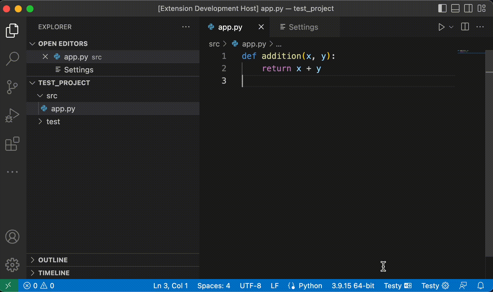

# testy README

Testy is a small utility tool for programmers who hate context switching between their source and test files. With the click of a button, testy will map your file from your source code folder, into your test code folder. 

NOTE: Testy assumes that your test file structure will mirror your source code file structure. 

## Features

Given a file within a soure code directory, automatically generate an accompanying test file and easily navigate between the two. 

Easy access to configure Testy settings

## Requirements

The extension must be configured before use. Click the `Testy Settings` status item button to open the settings. 

1. add the absolute file path of your project's source code directory.
2. add the absolute file path of your project's test code directory.
3. configure how you want Testy to generate your test file names.
   1. prefix example: append `test_` to all python tests.
   2. suffix example: append `Test` to all java tests.
   3. none: just directly copy the file name from source directory to test directory.

## Extension Settings

This extension contributes the following settings:

* `testy.required.setCodeSourceDirectory`: Add absolute file path of your source directory.
* `testy.required.setTestSourceDirectory`: Add absolute file path of your test directory.
* `testy.testGeneration.setTestFileNameGenerationType`: Configure how you want to customize your test file name generation. You can either add to start or end of your source file name. 
* `testy.testGeneration.setTestFileAppendText`: What custom text you want to append/prepend to your source file name to create a test file name.

## Known Issues

* Error thrown when navigating from a test file to a source file that doesn't exist. Testy only generates tests files from source files, and not the other way around.
